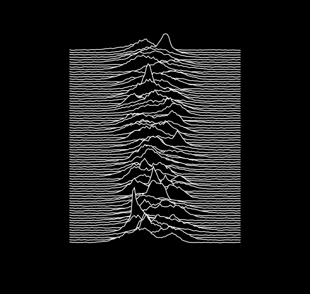

# Unknown Pleasures - A Fortran Generator

The origin of this work is the [Javascript version](https://github.com/MaxHalford/procedural-art/blob/master/3_unknown_pleasures.html) created by Max Halford, and published under the MIT license. He explains on his [blog](https://maxhalford.github.io/blog/unknown-pleasures/) how he progressively designed his algorithm to draw figures similar to the [iconic figure](http://cococubed.asu.edu/pix_pages/joy_division_unknown_pleasures.shtml) "Many consecutive pulses from CP 1919" of Harold D. Craft's Ph.D. thesis. [CP 1919](https://en.wikipedia.org/wiki/PSR_B1919%2B21) is the first discovered pulsar, by the Ph.D. student [Jocelyn Bell](https://en.wikipedia.org/wiki/Jocelyn_Bell_Burnell) in 1967.

Bernard Sumner, the guitarist and keyboarder of Joy Division and future singer of New Order, found that figure in the *Cambridge Encyclopaedia of Astronomy* (1977) and ask the young [Peter Saville](https://en.wikipedia.org/wiki/Peter_Saville_(graphic_designer)) to  use it for the cover of their first album [_Unknown Pleasures_](https://en.wikipedia.org/wiki/Unknown_Pleasures) (1979).


	
In Memoriam Ian Curtis (1956-1980).

## Build and run

Our Fortran version uses [gtk-fortran](https://github.com/vmagnin/gtk-fortran/wiki) (GTK 4), and especially its [Cairo graphics library](https://www.cairographics.org/).

### With GFortran

```bash
$ ./build.sh && ./a.out
```

```bash
$ gfortran random.f90 unknown_pleasures.f90 $(pkg-config --cflags --libs gtk-4-fortran)
$ ./a.out
```

### With another compiler

You can use another compiler, for example ifort:

```bash
$ FC="ifort" ./build.sh
$ ./a.out
```
but in that case **gtk-fortran must be compiled with the same compiler.**


## Perspectives

* An animated version could be interesting. It could use a FIFO stack to store each ligne of the signal. Or maybe we could get and put the pseudorandom seed using `call random_seed()` in order to shift lines in the next frame.
* An SVG output.

## Contributing

* Post a message in the GitHub *Issues* tab to discuss the feature you want to work on,
* Concerning coding conventions, follow the stdlib conventions:
https://github.com/fortran-lang/stdlib/blob/master/STYLE_GUIDE.md
* When ready, make a *Pull Request*.


## Bibliography
* Jocelyn Bell Burnell, [*The measurement of radio source diameters using a diffraction method*](https://www.repository.cam.ac.uk/handle/1810/260694), Ph.D. thesis, 1969, https://doi.org/10.17863/CAM.4926 
* Harold D. Craft, Jr., *Radio Observations of the Pulse Profiles and Dispersion Measures of Twelve Pulsars,* Ph.D. thesis, September 1970.
* Matthew Robertson, [_Factory Records: The Complete Graphic Album_](https://factoryrecords.org/cerysmatic/fac461_factory_records_the_complete_graphic_album.php), FAC 461, Chronicle Books, 2006,  ISBN‎ 978-0811856768.
* Jen Christiansen, ["Pop Culture Pulsar: Origin Story of Joy Division's Unknown Pleasures Album Cover"](https://blogs.scientificamerican.com/sa-visual/pop-culture-pulsar-origin-story-of-joy-division-s-unknown-pleasures-album-cover-video/), *Scientific American Blog Network,* 18th February 2015.
* ———. ["Pop Culture Pulsar: The Science Behind Joy Division’s Unknown Pleasures Album Cover"]( https://blogs.scientificamerican.com/sa-visual/pop-culture-pulsar-the-science-behind-joy-division-s-unknown-pleasures-album-cover/), *Scientific American Blog Network,* 13th October 2015.
* Patrick Weltevrede, ["Joy Division: 40 Years on from “Unknown Pleasures,” Astronomers Revisit the Pulsar from the Iconic Album Cover"](https://theconversation.com/joy-division-40-years-on-from-unknown-pleasures-astronomers-have-revisited-the-pulsar-from-the-iconic-album-cover-119861), *The Conversation,* 11th July 2019.
* [Data Visualization, Reinterpreted: The Story of Joy Division's "Unknown Pleasures" Album Cover](https://www.youtube.com/watch?v=BxyDT11RD04). In this 2012 video Peter Saville explains the history of this artwork.
